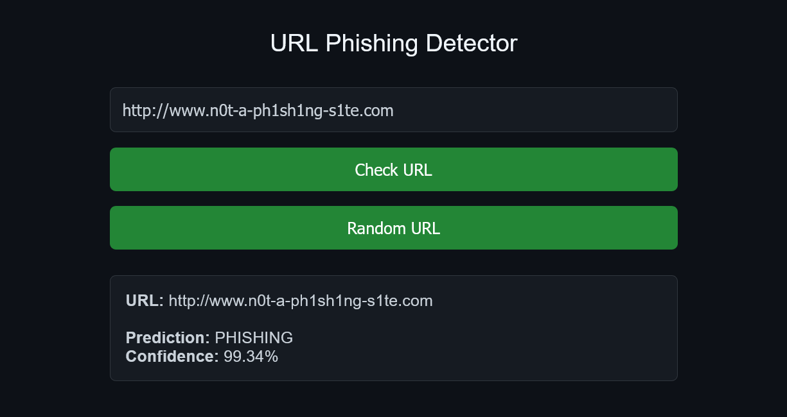

# Phishing URL Detector

A browser-based phishing URL detection tool that uses a trained Random Forest model to classify URLs as phishing or legitimate — entirely client-side via ONNX Runtime Web.

**Live demo:** https://kevbot404.github.io/phishing-url-detector/

## Overview

This project trains a machine learning model on real phishing datasets, converts it to ONNX format, and runs predictions directly in the browser.

## Interface

<p align="center">
  
</p>

## How It Works

1. **Feature extraction** — A URL is broken down into 16 structural features:
   - URL length, domain length, IP-based domain, subdomain count
   - Obfuscation metrics (character count, ratio)
   - Character distribution (letters, digits, special chars, ratios)
   - HTTPS presence

2. **Classification** — A Random Forest model (`n_estimators=200`, `max_depth=15`) predicts whether a URL is phishing or legitimate with a confidence score.

3. **Prediction in browser** — The model is loaded as an ONNX file and executed using [ONNX Runtime Web](https://github.com/microsoft/onnxruntime), keeping all computation client-side.

## Datasets

### PhiUSIIL Phishing URL (Website) Dataset

[UCI Machine Learning Repository – PhiUSIIL Phishing URL Dataset](https://archive-beta.ics.uci.edu/dataset/967/phiusiil%2Bphishing%2Burl%2Bdataset)

> Prasad, A., & Chandra, S. (2024). _PhiUSIIL Phishing URL (Website) [Dataset]._ UCI Machine Learning Repository. https://doi.org/10.1016/j.cose.2023.103545

### LegitPhish Dataset

For additional testing and evaluation, this project also uses the **LegitPhish Dataset**, published on Mendeley Data.

[LegitPhish Dataset – Mendeley Data](https://data.mendeley.com/datasets/hx4m73v2sf/2)

> Potpelwar, Rachana; Kulkarni, Uday; Waghmare, Jaishri (2025). _LegitPhish Dataset_, Mendeley Data, V2. https://doi.org/10.17632/hx4m73v2sf.2

## Project Structure

```
phishing-url-detector/
├── app/
│   ├── index.html        # Frontend UI
│   ├── style.css         # Styling
│   ├── script.js         # ONNX inference logic
│   ├── preprocess.js     # Client-side feature extraction
│   └── model/
│       └── model.onnx    # Converted model for browser
├── src/
│   ├── preprocessing/    # Feature extraction (Python)
│   ├── training/         # Model training (RandomForest)
│   ├── conversion/       # PKL → ONNX conversion
│   └── testing/          # Model evaluation using another external dataset
├── data/
│   └── data.csv          # Training data
└── models/               # Saved models
```

## Setup

### Prerequisites

- Python 3.8+

### Install Dependencies

```bash
pip install -r requirements.txt
```

### Train the Model

```bash
python -m src.training.train
```

### Test on external dataset (Optional)

```bash
python -m src.testing.test --mode dataset
```

### Run CLI demo

```bash
python -m src.testing.test --mode cli
```

### Browser

### Convert to ONNX

```bash
python -m src.conversion.pkl_to_onnx.py
```

Then move the .onnx file from models/ to app/

### Serve Locally

```bash
python -m http.server 8000 --directory app
```

Then open http://localhost:8000 in your browser.

## Usage

1. Enter a full URL into the input field (e.g., `https://www.google.com`)
2. Click **Check URL** to run inference
3. Or click **Random URL** to test with a random example
4. View the prediction (Phishing / Legitimate) and confidence score

## Model Details

| Parameter    | Value         |
| ------------ | ------------- |
| Algorithm    | Random Forest |
| Estimators   | 200           |
| Max Depth    | 15            |
| Class Weight | balanced      |
| Features     | 16            |
| Test Split   | 20%           |
